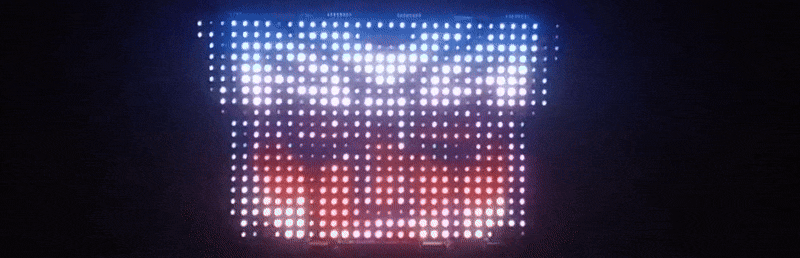

# BLE LED Matrix Controller

This repository houses the results of my experimentation with a 96x20 flexible LED matrix (brand name ATOTOZONE CI-VIALD19).

[Amazon Link](https://www.amazon.ca/dp/B0DDWTX8RZ?th=1)

This is not an official endorsement of this product, but the link is provided for reference. It may also apply to similar products, since several different products appear to be using a similar LED matrix PCB.

This particular unit appears to have the model number MI 4.5-20-2121-96X20 V1.1 (2023.12.21). Here's a picture for reference:

## Current Status

The `gif_uploader.py` script allows you to upload a custom GIF animation or static image to the LED matrix.
It works really well, and seems to support any GIF under 49,980 bytes.

For more info, check out my blog post on this project:
<https://overscore.media/posts/reverse-engineering-a-ble-led-matrix>

## Examples

Charming pixel art food by **ARoachIFoundOnMyPillow** on OpenGameArt: <https://opengameart.org/content/16x16-food>

Nyan Cat (a little squished, but you get the point)

An example GIF from <https://learn.adafruit.com/animated-gif-player-for-matrix-portal/example-gifs> resized to fit this display

## Roadmap

The main goal of this project is to replace the app required to use this LED matrix. At this point, the main function of the app (uploading GIF animations) has been replicated, with the addition of custom GIF upload (not limited to the pre-loaded animations from the app).

Technically, other features of the app could be replicated, but at this point I'm happy with the state of things (at least for now).

If I do revisit this project, or if anybody else wants to take it on, here are some thoughts for next steps in rough priority order:

- Implement brightness changing and screen on/off
- Implement animation storing and swapping between stored animations without having to re-upload them
- Custom text animations
- Reverse-engineer protocol used to upload "drawings" (app has a free draw mode)
- Custom app (desktop, mobile, and/or web)
- ESP32 impleemntation with web interface
- Implement animation syncing (requires multiple screens, but seems to be possible)
- Uncover internal/pre-loaded animations on screen (there seem to be a few)
- Push the limits of GIF size/length, or try real-time streaming
